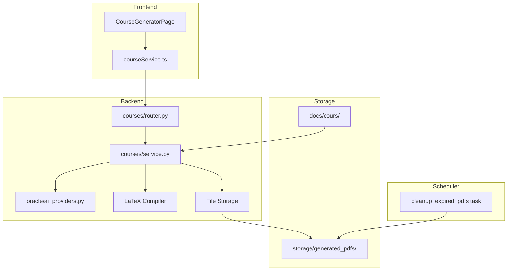
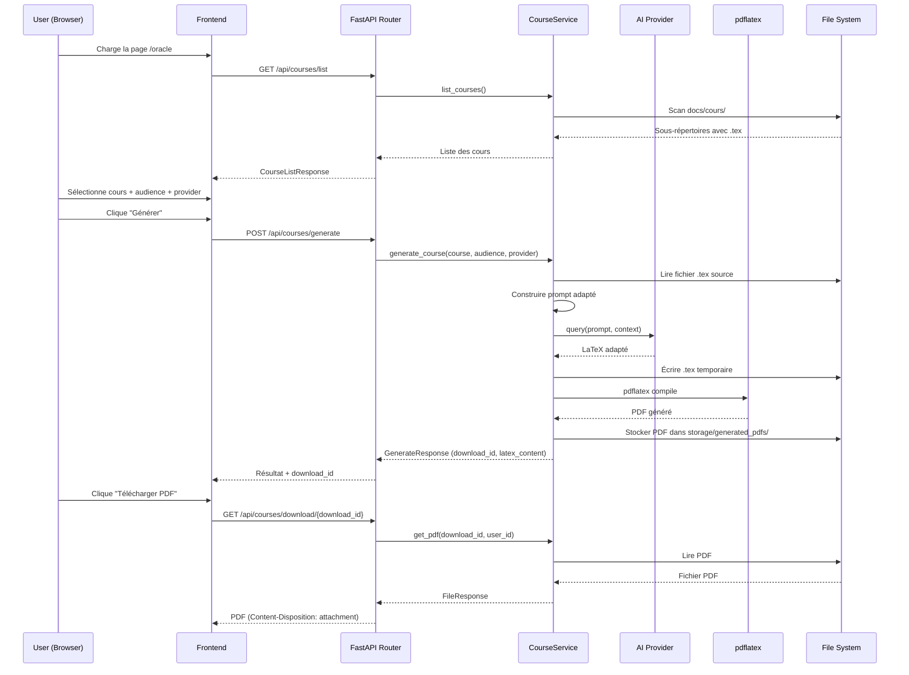

# Design Document: Course Generator

## Overview

Le Course Generator transforme la page Oracle existante en un outil de génération de cours mathématiques adaptés. Le système scanne les fichiers LaTeX dans `docs/cours/`, permet la sélection d'un niveau d'audience et d'un fournisseur IA, génère un cours adapté via l'IA, compile le résultat en PDF et offre un téléchargement temporaire (1h).

L'architecture conserve le pattern existant du module Oracle (router → service → AI provider) tout en ajoutant une couche de compilation LaTeX et de gestion de fichiers temporaires. Le frontend passe d'une interface chat à un workflow en 3 étapes (sélection cours → audience → génération/téléchargement).

### Décisions architecturales clés

1. **Nouveau module `app/courses/`** plutôt que modification in-place de `app/oracle/` — permet un déploiement incrémental et conserve l'historique Oracle pour référence.
2. **Réutilisation de `ai_providers.py`** — les providers IA restent dans `app/oracle/` et sont importés par le nouveau module.
3. **Stockage temporaire sur disque** (`storage/generated_pdfs/`) — simple, adapté au volume attendu, avec cleanup automatique via le scheduler existant.
4. **Rate limiting par user_id** — le rate limit de 5/heure est appliqué par utilisateur authentifié (pas par IP) en utilisant une clé custom dans slowapi.
5. **pdflatex** doit être ajouté au Dockerfile pour la compilation LaTeX.

---

## Architecture



### Flux de données principal



---

## Components and Interfaces

### Backend Components

#### 1. `app/courses/router.py` — FastAPI Router

```python
# Prefix: /api/courses
# Tags: ["courses"]

# Endpoints:
GET  /api/courses/list           → CourseListResponse
POST /api/courses/generate       → GenerateResponse  (auth required, rate limited 5/hour)
GET  /api/courses/download/{id}  → FileResponse      (auth required)
```

#### 2. `app/courses/service.py` — CourseService

Responsabilités :
- Scanner `docs/cours/` pour lister les cours disponibles
- Construire le prompt d'adaptation selon le niveau d'audience
- Appeler le fournisseur IA via `get_ai_provider()`
- Compiler le LaTeX en PDF via subprocess (pdflatex)
- Gérer le stockage et l'expiration des fichiers PDF

#### 3. `app/courses/schemas.py` — Pydantic Schemas

Définit les modèles de requête/réponse pour l'API.

#### 4. `app/courses/prompt_builder.py` — Prompt Construction

Module dédié à la construction des prompts structurés pour l'adaptation de cours. Encapsule la logique de directives par niveau d'audience.

#### 5. Scheduler Task — Cleanup des PDFs expirés

Ajout d'une tâche au scheduler existant (`app/scheduler.py`) pour supprimer les PDFs > 1 heure.

### Frontend Components

#### 1. `CourseGeneratorPage.tsx` — Page principale (remplace OraclePage)

Composant React principal avec les 3 sections :
- Section 1 : Sélection du cours (liste scrollable)
- Section 2 : Sélection de l'audience (radio buttons) + provider
- Section 3 : Génération (bouton, indicateur, résultat, téléchargement)

#### 2. `courseService.ts` — Service API (remplace oracleService)

Client HTTP pour les endpoints `/api/courses/*`.

---

## Data Models

### Backend Schemas (Pydantic)

```python
# --- Request Models ---

class GenerateCourseRequest(BaseModel):
    """Requête de génération de cours adapté"""
    course_name: str = Field(..., min_length=1, max_length=200,
                             description="Nom du sous-répertoire du cours")
    audience: Literal[
        "seconde",
        "terminale",
        "licence",
        "master",
        "ingenieur",
        "professeur",
        "chercheur"
    ] = Field(..., description="Niveau d'audience cible")
    ai_provider: Literal["shai", "kiro", "openai"] = Field(
        default="shai", description="Fournisseur IA"
    )

# --- Response Models ---

class CourseItem(BaseModel):
    """Un cours disponible"""
    name: str           # Nom du répertoire (ex: "Automatique.Linéaire")
    display_name: str   # Nom formaté (ex: "Automatique Linéaire")
    has_pdf: bool       # Si le PDF source existe aussi

class CourseListResponse(BaseModel):
    """Liste des cours disponibles"""
    courses: List[CourseItem]
    total: int

class GenerateResponse(BaseModel):
    """Réponse de génération réussie"""
    download_id: str          # UUID pour télécharger le PDF
    latex_content: str        # Contenu LaTeX généré (pour visualisation/copie)
    course_name: str          # Nom du cours source
    audience: str             # Niveau d'audience utilisé
    ai_provider: str          # Provider utilisé
    filename: str             # Nom du fichier PDF généré
    expires_at: datetime      # Timestamp d'expiration du download

class GenerateErrorResponse(BaseModel):
    """Réponse d'erreur de génération"""
    error: str
    error_type: Literal["ai_error", "compilation_error", "timeout", "rate_limit"]
    details: Optional[str] = None  # Log compilateur tronqué (max 2000 chars)
```

### File Storage Model (en mémoire / fichier JSON)

```python
@dataclass
class GeneratedPDF:
    """Métadonnées d'un PDF généré stocké sur disque"""
    download_id: str        # UUID unique
    user_id: str            # UUID de l'utilisateur propriétaire
    file_path: str          # Chemin absolu vers le fichier PDF
    filename: str           # Nom de fichier pour le download
    created_at: datetime    # Timestamp de création
    expires_at: datetime    # created_at + 1 heure
    course_name: str
    audience: str
```

Un fichier JSON `storage/generated_pdfs/index.json` persiste les métadonnées des PDFs actifs. Le service le charge au démarrage et le met à jour à chaque génération/suppression.

### Frontend Types (TypeScript)

```typescript
interface CourseItem {
  name: string;
  display_name: string;
  has_pdf: boolean;
}

interface CourseListResponse {
  courses: CourseItem[];
  total: number;
}

interface GenerateCourseRequest {
  course_name: string;
  audience: AudienceLevel;
  ai_provider: 'shai' | 'kiro' | 'openai';
}

type AudienceLevel =
  | 'seconde'
  | 'terminale'
  | 'licence'
  | 'master'
  | 'ingenieur'
  | 'professeur'
  | 'chercheur';

interface GenerateResponse {
  download_id: string;
  latex_content: string;
  course_name: string;
  audience: string;
  ai_provider: string;
  filename: string;
  expires_at: string;
}

// Mapping audience key → display label
const AUDIENCE_LABELS: Record<AudienceLevel, string> = {
  seconde: 'Élève de Seconde (15-16 ans, lycée)',
  terminale: 'Élève de Terminale (17-18 ans, lycée)',
  licence: 'Étudiant en Licence (L1-L3, université)',
  master: 'Étudiant en Master Mathématiques',
  ingenieur: 'Élève ingénieur Grande École',
  professeur: 'Professeur des universités',
  chercheur: 'Chercheur en entreprise / laboratoire',
};
```

### Prompt Structure

Le prompt envoyé à l'IA suit cette structure :

```
[SYSTEM] Tu es un expert en pédagogie des mathématiques...

[DIRECTIVES DE NIVEAU]
- Vocabulaire: {adapté au niveau}
- Détail: {profondeur des explications}
- Exemples: {type et quantité}
- Directives spécifiques au niveau (seconde/terminale vs chercheur/prof)

[CONTRAINTES LATEX]
- Produire du LaTeX valide
- Préserver les environnements: theorem, definition, proof, equation, align
- Préserver les packages: amsmath, amssymb, amsthm
- Rédiger intégralement en français

[CONTENU SOURCE]
{contenu intégral du fichier .tex}
```

